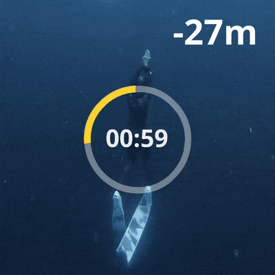
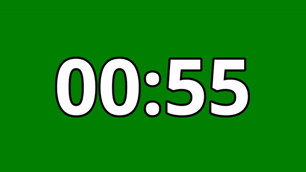

<div align="center">
  <a href="#">
  
  </a>
  <a name="readme-top"></a>

*A CLI tool that creates heads-up displays <br>for your **freediving videos**, <br>automatically tracking **depth** and **time** <br>from your **dive computer logs** or **manual input**.*

[![PyPI - Version][version_badge_img]][version_badge_url] [![GitHub Actions Workflow Status][build_badge_img]][build_badge_url] [![Coveralls][coverage_badge_img]][coverage_badge_url] [![PyPI - Status][pypi_status_img]][pypi_status_url] [![PyPI Downloads][download_badge_img]][download_badge_url]

**&searr;&nbsp;&nbsp;Quick Links&nbsp;&nbsp;&swarr;**

[Features](#-features) • [Installation](#️-installation) • [Usage](#-usage) • [No Dive Computer?](#-no-dive-computer) • [How It Works](#-how-it-works) • [Contribution](#-contribution) • [License](#️-license) • [Contact](#-contact)

**&searr;&nbsp;&nbsp;Share the project's link to your friends&nbsp;&nbsp;&swarr;**

[![Share on X][x_share_img]][x_share_url] [![Share on Facebook][facebook_share_img]][facebook_share_url] [![Share on Telegram][telegram_share_img]][telegram_share_url] [![Share on WhatsApp][whatsapp_share_img]][whatsapp_share_url] [![Share on Reddit][reddit_share_img]][reddit_share_url]
</div>


---
## ✨ Features


 
Key features of `depthviz` include:
* 100% **free** and **open-source** for **all freedivers**, **with** or **without** a dive computer.
* Cross-platform support for **Windows**, **macOS**, and **Linux**.
* Supports various dive computer data formats, including **Apnealizer**, **Shearwater**, **Garmin**, and **Suunto**.
* **Customizable display** with options for decimal places, font, background color, and stroke width.
* Works with **free** video editors like [CapCut](https://www.capcut.com/) and much more, no high-end software needed.
* **Automatically** generates a depth overlay video from your dive log data.
* Generates the **time** overlay as a separate video to display the time elapsed during the dive.
* Linear interpolation to fill in gaps in the dive log data for a **smooth depth profile**.

> [!TIP]
> For performance freedivers, you can incorporate `depthviz` into your dive analysis. By visualizing your dive profile, you can identify areas for improvement and track your progress over time.


<div align="right">

[&nwarr; Back to top](#readme-top)

</div>

---

## 🌟 Like depthviz?

Please give us a shiny [](https://github.com/noppanut15/depthviz) and share `depthviz` with your freediving community! ⭐️

<div align="right">

[&nwarr; Back to top](#readme-top)

</div>

## 🛠️ Installation

**Prerequisites:**

* [Python](https://www.python.org/downloads/) (3.9 or higher) installed on your system.
* [pipx](https://pipx.pypa.io/stable/installation/) for installing Python CLI tools.

**Install:**
Run the following command in your terminal to install `depthviz` using `pipx`:
```bash
pipx install depthviz
```

**Upgrade:**
When a new version is released, you can upgrade to the latest version using the following command:

```bash
pipx upgrade depthviz
```

<div align="right">

[&nwarr; Back to top](#readme-top)

</div>

## 🚀 Usage

### Step 1: Download Your Data

- **✅ If you have a dive computer:**<br>Export your dive log from your dive computer or diving application. See the [Data Source](#data-source) for supported formats.
- **🚫 If you don't have a dive computer:**<br>Record your dive profile manually using depth markers in your footage. See the [No Dive Computer?](#-no-dive-computer) section for more details.

### Step 2: Generate the Overlay

Use `depthviz` to generate a depth overlay video from your dive log.

```bash
depthviz -i <input_file> -s <source> -o <output_video.mp4>
```
| &nbsp;&nbsp;&nbsp;&nbsp;Option&nbsp;&nbsp;&nbsp;&nbsp; | Short | Values                                                               | Description                                                                    |
| ------------------------------------------------------ | ----- | -------------------------------------------------------------------- | ------------------------------------------------------------------------------ |
| `--input`                                              | `-i`  | File path                                                            | Path to your dive log file.                                                    |
| `--source`                                             | `-s`  | `apnealizer`,<br>`shearwater`,<br>`garmin`,<br>`suunto`,<br>`manual` | Source of the data.<br>(See the [Data Source](#data-source) for more details.) |
| `--output`                                             | `-o`  | File path                                                            | Path or filename for the generated video. File format must be `.mp4`.          |

#### Data Source

|    Source    | Description                                                                                                                                                                                                                                                   | File type |
| :----------: | ------------------------------------------------------------------------------------------------------------------------------------------------------------------------------------------------------------------------------------------------------------- | :-------: |
| `apnealizer` | Data from **Apnealizer** application. <br> [![Get log][get_log_img]](https://apnealizer.com/)                                                                                                                                                                 |    CSV    |
| `shearwater` | Data from **Shearwater** dive computers. <br> [![Get log][get_log_img]](https://shearwater.com/pages/shearwater-cloud)                                                                                                                                        |    XML    |
|   `garmin`   | Data from **Garmin** dive computers. <br> [![Get log][get_log_img]](https://connect.garmin.com/signin/) [![How to][how_to_img]](https://github.com/noppanut15/depthviz/blob/main/docs/GARMIN.md)                                                              |    FIT    |
|   `suunto`   | Data from **Suunto** dive computers. <br> [![Get log][get_log_img]](https://www.suunto.com/suunto-app/suunto-app-2022/)  [![How to][how_to_img]](https://www.suunto.com/Support/faq-articles/suunto-app/what-type-of-files-can-i-export-from-the-suunto-app/) |    FIT    |
|   `manual`   | Manual depth input without a dive computer. <br> [![How to][how_to_img]](#-no-dive-computer)                                                                                                                                                                  |    CSV    |

<details><summary><strong>Example Command</strong></summary><br>

Example of generating a depth overlay video named `depth_overlay.mp4` using data from `123456_ACTIVITY.fit` exported from [Garmin Connect](https://github.com/noppanut15/depthviz/blob/main/docs/GARMIN.md).

```bash
depthviz -i 123456_ACTIVITY.fit -s garmin -o depth_overlay.mp4
```

</details>

#### Advanced Options
| &nbsp;&nbsp;&nbsp;&nbsp;&nbsp;&nbsp;&nbsp;&nbsp;&nbsp;&nbsp;&nbsp;&nbsp;Option&nbsp;&nbsp;&nbsp;&nbsp;&nbsp;&nbsp;&nbsp;&nbsp;&nbsp;&nbsp;&nbsp;&nbsp; | Values            | Default                                                     | Description                                                                   |
| ------------------------------------------------------------------------------------------------------------------------------------------------------ | ----------------- | ----------------------------------------------------------- | ----------------------------------------------------------------------------- |
| `-d`, <br/>`--decimal-places`                                                                                                                          | `0-2`             | `0`                                                         | Number of decimal places to display in the depth overlay.                     |
| `--no-minus`                                                                                                                                           | -                 | -                                                           | Hide the minus sign for depth values (e.g., display `10m` instead of `-10m`). |
| `--font`                                                                                                                                               | File path         | [Default font](https://fonts.google.com/specimen/Open+Sans) | Path to a custom font file for the text.                                      |
| `--bg-color`                                                                                                                                           | Color name or hex | `black`                                                     | Background color (e.g., `green`, `'#000000'`).                                |
| `--stroke-width`                                                                                                                                       | Positive integer  | `5`                                                         | Width of the stroke around the text in pixels.                                |


<details><summary><strong>Example Command with Advanced Options</strong></summary><br>

Example of generating a depth overlay video named `mydive.mp4` using data from `123456_ACTIVITY.fit` exported from [Garmin Connect](https://github.com/noppanut15/depthviz/blob/main/docs/GARMIN.md):

```bash
depthviz -i 123456_ACTIVITY.fit -s garmin -o mydive.mp4 --decimal-places 1 --no-minus --bg-color green --font ~/Downloads/font.ttf
```

- The depth values will be displayed with **one** decimal place.
- The minus sign will be **hidden**.
- The background color will be set to **green**.
- A **custom font** file at `~/Downloads/font.ttf` will be used for the text.


---
</details>
<br>

<p align="center"></p>

> [!TIP]
> Use the `--decimal-places` option to control the precision of the depth display (e.g., `--decimal-places 1` displays depths like `-12.5m`)


#### Time Overlay Video

<p align="center"></p>

You can also generate a time overlay video as a separate video that displays the time elapsed during the dive. It will be exported in the same directory as the depth overlay video.

| &nbsp;&nbsp;&nbsp;&nbsp;&nbsp;&nbsp;&nbsp;&nbsp;&nbsp;&nbsp;&nbsp;&nbsp;Option&nbsp;&nbsp;&nbsp;&nbsp;&nbsp;&nbsp;&nbsp;&nbsp;&nbsp;&nbsp;&nbsp;&nbsp; | Values | Description                  |
| ------------------------------------------------------------------------------------------------------------------------------------------------------ | ------ | ---------------------------- |
| `--time`                                                                                                                                               | -      | Create a time overlay video. |

<details><summary><strong>Example Command with Time Overlay</strong></summary><br>

Example of generating a depth overlay video named `mydive.mp4` and a time overlay video by adding the `--time` option:

```bash
depthviz -i 123456_ACTIVITY.fit -s garmin -o mydive.mp4 --time
```
The time overlay video will be automatically generated and saved in the same directory as the depth overlay video with the filename `mydive_time.mp4`.

---

</details>


### Step 3: Integrate with Your Footage

Import the generated **depth overlay** video and **time overlay** video (if used) into your preferred video editing software. Combine them with your original dive footage. Remove the background color if needed. Adjust position of the overlays to suit your video style.

> [Watch this short tutorial](https://www.youtube.com/watch?v=ZggKrWk98Ag) on how to import an overlay video in CapCut Desktop.

> [!TIP]
> **Chroma Keying**: If you want to remove the background color from the overlay video, you can use the [chroma key](https://en.wikipedia.org/wiki/Chroma_key) effect in your video editor. You can use the `--bg-color` option to set the background color to match your video editor's chroma key color. `--bg-color green` is a common choice.

<div align="right">

[&nwarr; Back to top](#readme-top)

</div>

## 🚫 No Dive Computer?

**No Dive Computer, No Problem!** You can still create a depth overlay video by **manually inputting your dive log** using the `-s manual` source option.

**Example Command**:
```bash
depthviz -i manual_input.csv -s manual -o output_video.mp4
```

Freediving ropes with **depth markers** can help you record your dive profile manually. Use the depth markers in your footage as reference points to manually record your dive profile. Simply note the time and depth at each marker point to create your dive log.


|     |
| :----------------------------------------------------------------------------------------------------------------------------------------------: |
| *Example of a [Freediving Rope](https://2bfreeequipment.com/shop/2-b-free-freediving-rope-superstatic-marked-with-stopper/) with depth markers.* |

**Manual Mode Input File Format:**

The input file for manual mode should be a CSV file with the following columns:

* `Time`: The time in seconds (e.g., `0`, `1`, `2`, ...).
* `Depth`: The depth in meters (e.g., `10`, `9`, `8`, ...).

**You don't need to record the depth at every second.** Record the depth at each time point where a depth marker is visible in your footage. `depthviz` will interpolate the depth values between the recorded points to create a smooth depth profile. 

> [!TIP]
> To quickly generate a basic depth overlay, you can record just three points: **the start** (0m), **the maximum depth**, and **the end** (0m). `depthviz` will handle the rest! For more complex dives (e.g., dives with significant variations in descent/ascent rate or bottom time), more data points are recommended.

Here is an example of a manual mode input file:

| Time  | Depth |
| :---: | :---: |
|   0   |   0   |
|   6   |   5   |
|  12   |  10   |
|  19   |  15   |
|  26   |  10   |
|  33   |   5   |
|  39   |   0   |

Download the example input file here:
[](https://github.com/noppanut15/depthviz/blob/main/assets/manual-input-example.csv)

<div align="right">

[&nwarr; Back to top](#readme-top)

</div>

## 🧠 How It Works
`depthviz` works by parsing dive log data exported from various dive computers (or manually inputting dive data) and generating an overlay video that displays depth information.

Dive computers typically record either depth directly or pressure data. If the data is recorded as pressure, it is in the form of **absolute pressure**, which includes both atmospheric pressure and the pressure exerted by the water itself (hydrostatic pressure).


To determine the depth, `depthviz` uses the following approach:
1.  **If the dive log contains depth data directly:** `depthviz` uses this data directly.
2.  **If the dive log contains pressure data:**
    * First, the **hydrostatic pressure** is calculated by subtracting atmospheric pressure (collected during the surface interval or dive start) from the absolute pressure:<br><br><p align="center"><picture><source media="(prefers-color-scheme: dark)" srcset="https://latex.codecogs.com/svg.image?\large&space;{\color{White}\text{Hydrostatic&space;Pressure}=\text{Absolute&space;Pressure}-\text{Atmospheric&space;Pressure}}"></picture></p><br>
    * Then, the **fluid pressure formula** is used to calculate the depth:<br><br><p align="center"><picture><source media="(prefers-color-scheme: dark)" srcset="https://latex.codecogs.com/svg.image?\LARGE&space;{\color{White}P=\rho&space;g&space;h}"></picture></p> 
       Where:
         - $` P `$ is the fluid pressure,
         - $` \rho `$ is the density of the fluid (water),
         - $` g `$ is the acceleration due to gravity (9.80665 m/s²),
         - $` h `$ is the height (or depth) of the fluid column (what we want to calculate).
    * Rearranging the formula to solve for depth ($` h `$):<br><br><p align="center"><picture><source media="(prefers-color-scheme: dark)" srcset="https://latex.codecogs.com/svg.image?\LARGE&space;{\color{White}h=\frac{P}{\rho&space;g}}"></picture></p><br>

Currently, `depthviz` uses a water density ($` \rho `$) according to the **EN13319 standard**, a European CE standard for dive computers, which assumes a water density of 1019.7 kg/m³.

The water density can vary depending on the type of water (e.g., freshwater, saltwater). Even different locations in the ocean can have varying densities. This variability can affect the accuracy of depth calculations. For more precise measurements, users may need to adjust the density value based on their specific diving environment. Especially for freshwater diving, the water density is lower than the standard value, which can lead to depth overestimation. We will add support for custom water density in future releases.
    
> [!NOTE]
> The EN13319 standard ensures the accuracy and reliability of depth measurements in dive computers. For more information, you can refer to the [EN13319 standard](https://standards.iteh.ai/catalog/standards/cen/5d35e933-ca50-4d80-8c9d-631f5597b784/en-13319-2000).

3. **Fill in the Gaps**: Different dive computers have different sampling rates, and the data may not be recorded at regular intervals. If the dive log data contains gaps or missing values, `depthviz` uses **Linear Interpolation** to estimate the depth at those points. This method calculates the depth at each time point by interpolating between the two nearest known depth values recorded by the dive computer. This will help ensure a smooth and continuous depth profile in the overlay video.

<p align="center"></p>

> [!NOTE]
> Learn more about the [Linear Interpolation](https://en.wikipedia.org/wiki/Linear_interpolation) method and how it is used to estimate values between two known depths.

4. **Generate Overlay Video**: The depth information from the linearly interpolated data is rendered into an overlay video, displaying the depth over time. This overlay can then be combined with your original dive footage in your video editor.

<div align="right">

[&nwarr; Back to top](#readme-top)

</div>

## 🌱 Contribution

We welcome contributions to the `depthviz` project! If you have any ideas for improvement, bug fixes, or feature suggestions, feel free to [open an issue](https://github.com/noppanut15/depthviz/issues) to discuss or [submit a pull request](https://github.com/noppanut15/depthviz/pulls).

<div align="right">

[&nwarr; Back to top](#readme-top)

</div>

## ⌚ Help Us Expand Dive Computer Support!

**Missing your dive computer?** Help us add support! If you have a dive computer that is not currently supported by `depthviz`, you can help us by donating a sample dive log file exported from your device. This will allow us to analyze the data format and implement the necessary parsing logic to add support for your device.

To share your dive data, please follow the detailed instructions in our [**Donate My Dive**](https://github.com/noppanut15/depthviz/issues/15) guide.

<div align="right">

[&nwarr; Back to top](#readme-top)

</div>

## ⚖️ License

This project is licensed under the Apache License 2.0. See the [LICENSE](https://github.com/noppanut15/depthviz/blob/main/LICENSE) file for details.

<div align="right">

[&nwarr; Back to top](#readme-top)

</div>

## 📦 CycloneDX SBOM

This project provides a CycloneDX Software Bill of Materials (SBOM) in JSON format. The SBOM is generated by the [GitHub Actions workflow](https://github.com/noppanut15/depthviz/blob/main/.github/workflows/deploy.yaml) and is available as an artifact for each release. The SBOM is generated using the [cyclonedx-python](https://github.com/CycloneDX/cyclonedx-python) library.

<div align="right">

[&nwarr; Back to top](#readme-top)

</div>

## 📬 Contact

For any inquiries, please [open an issue](https://github.com/noppanut15/depthviz/issues) or contact the maintainer at [noppanut.connect@gmail.com](mailto:noppanut.connect@gmail.com).

<div align="right">

[&nwarr; Back to top](#readme-top)

</div>

<!-- Badge links -->
[version_badge_img]: https://img.shields.io/pypi/v/depthviz?label=version&logo=pypi&logoColor=white
[build_badge_img]: https://img.shields.io/github/actions/workflow/status/noppanut15/depthviz/deploy.yaml?logo=github
[coverage_badge_img]: https://img.shields.io/coveralls/github/noppanut15/depthviz?logo=coveralls
[pypi_status_img]: https://img.shields.io/pypi/status/depthviz?logo=pypi&logoColor=white
[download_badge_img]: https://static.pepy.tech/badge/depthviz
[version_badge_url]: https://pypi.org/project/depthviz/
[build_badge_url]: https://github.com/noppanut15/depthviz/actions
[coverage_badge_url]: https://coveralls.io/github/noppanut15/depthviz
[pypi_status_url]: https://pypi.org/project/depthviz/
[download_badge_url]: https://pepy.tech/projects/depthviz

<!-- Social links -->
[x_share_url]: https://x.com/intent/tweet?hashtags=depth%2Cfreediving%2Chud&text=A%20CLI%20tool%20that%20creates%20heads-up%20displays%20for%20your%20freediving%20videos%2C%20automatically%20tracking%20depth%20and%20time%20from%20dive%20computer%20logs%20or%20manual%20records.&url=https%3A%2F%2Fgithub.com%2Fnoppanut15%2Fdepthviz
[telegram_share_url]: https://t.me/share/url?url=https%3A//github.com/noppanut15/depthviz&text=A%20CLI%20tool%20that%20creates%20heads-up%20displays%20for%20your%20freediving%20videos,%20automatically%20tracking%20depth%20and%20time%20from%20dive%20computer%20logs%20or%20manual%20records.
[whatsapp_share_url]: https://api.whatsapp.com/send?text=A%20CLI%20tool%20that%20creates%20heads-up%20displays%20for%20your%20freediving%20videos%2C%20automatically%20tracking%20depth%20and%20time%20from%20dive%20computer%20logs%20or%20manual%20records.%20https%3A%2F%2Fgithub.com%2Fnoppanut15%2Fdepthviz
[reddit_share_url]: https://www.reddit.com/submit?url=https%3A%2F%2Fgithub.com%2Fnoppanut15%2Fdepthviz&title=A%20CLI%20tool%20that%20creates%20heads-up%20displays%20for%20your%20freediving%20videos%2C%20automatically%20tracking%20depth%20and%20time%20from%20dive%20computer%20logs%20or%20manual%20records.%20%23depth%20%23freediving
[facebook_share_url]: https://www.facebook.com/sharer/sharer.php?u=https%3A//github.com/noppanut15/depthviz
[x_share_img]: https://img.shields.io/badge/x_(twitter)-black?style=for-the-badge&logo=x
[telegram_share_img]: https://img.shields.io/badge/telegram-black?style=for-the-badge&logo=telegram
[whatsapp_share_img]: https://img.shields.io/badge/whatsapp-black?style=for-the-badge&logo=whatsapp
[reddit_share_img]: https://img.shields.io/badge/reddit-black?style=for-the-badge&logo=reddit
[facebook_share_img]: https://img.shields.io/badge/facebook-black?style=for-the-badge&logo=facebook

<!-- Help -->
[how_to_img]: https://img.shields.io/badge/How%20to-1974D2?style=flat-square&logo=gitbook&logoColor=white
[get_log_img]: https://img.shields.io/badge/Get%20log-1974D2?style=flat-square&logo=transmission&logoColor=white