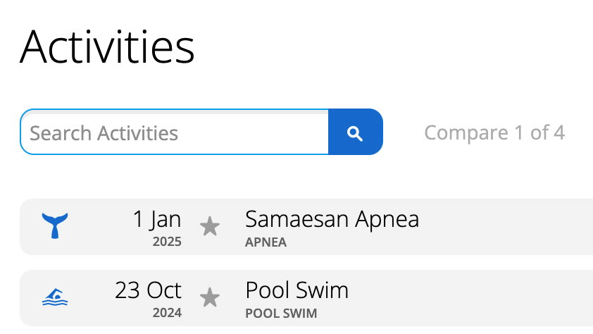
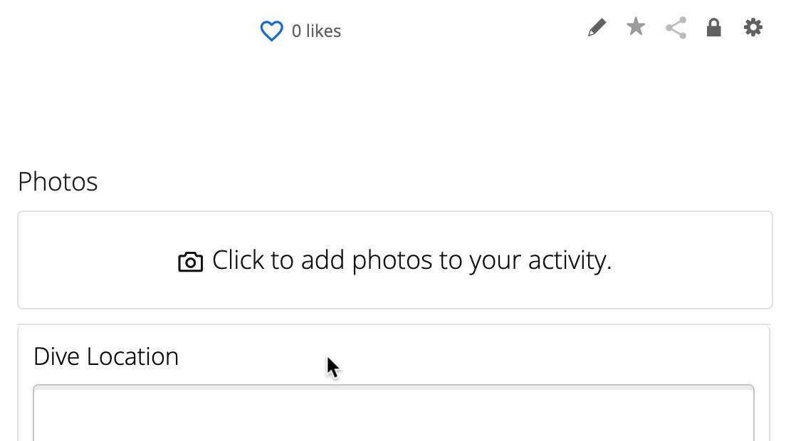

# Export a Diving Activity From the Garmin Connect Website

Follow these steps to export a diving activity from the Garmin Connect website:

1. From a web browser, sign into your [**Garmin Connect**](https://connect.garmin.com/signin/) account.

2. Select **Activities** from the navigation bar on the left.

3. Select **All Activities**.

4. Select the name of the diving session you would like to export.
   
   

5. Select the settings gear in the top right corner.

   

6. Select "**Export File**" from the drop-down menu. The file will then begin to download.

> [!IMPORTANT]
> If you get a `.zip` file, extract the `.fit` file from the `.zip` file.

## Additional Resources

- [How Do I Export Data Out of Garmin Connect?](https://support.garmin.com/en-US/?faq=W1TvTPW8JZ6LfJSfK512Q8)
- [DepthViz Documentation](https://github.com/noppanut15/depthviz)